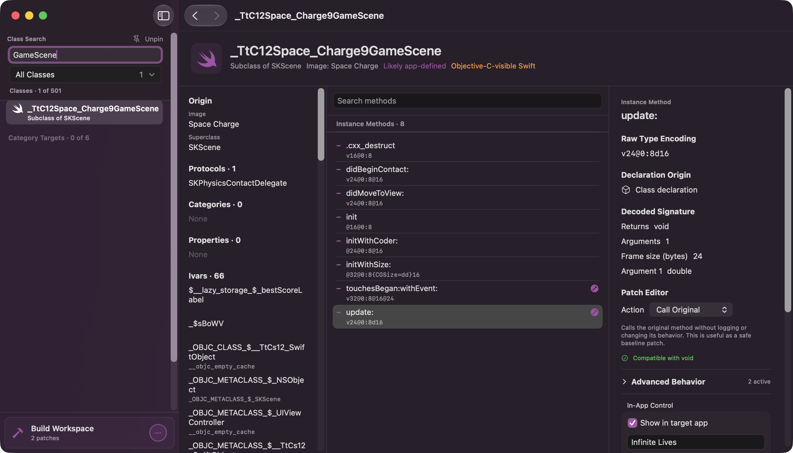
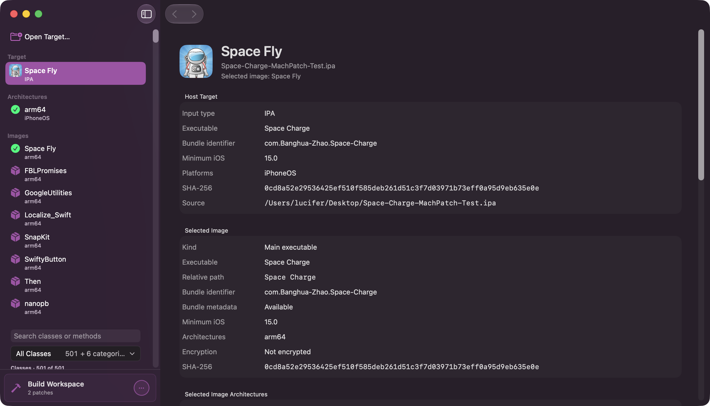
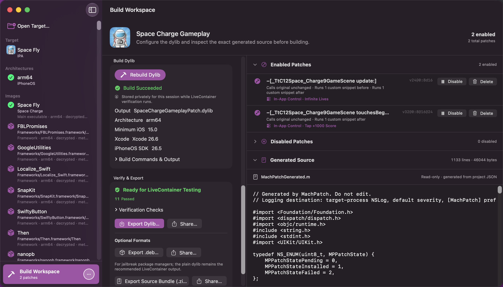
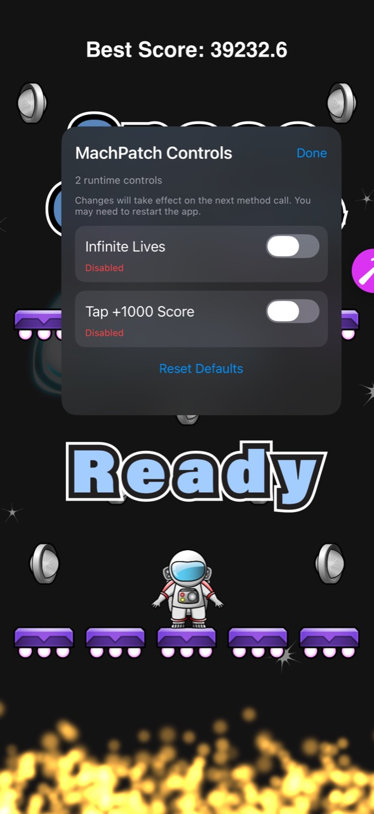

# MachPatch

MachPatch is an Apple Silicon macOS application for inspecting decrypted iOS software and
building self-contained Objective-C runtime patch dylibs. It provides a native SwiftUI workflow
for interactive use and a scriptable command-line interface for automation.



## Highlights

- Open a decrypted IPA, extracted `.app`, `.framework`, or Mach-O executable without executing
  its contents.
- Inspect device architectures, encryption state, embedded images, Objective-C classes,
  Objective-C-visible Swift classes, categories, methods, properties, protocols, and ivars.
- Search classes and methods, decode type encodings, and see exactly which patch actions are safe
  for a method's complete ABI signature.
- Create type-aware returns, original-call patches, argument replacements, conditions, counters,
  alerts, logging, Foundation object values, and expert Objective-C snippets.
- Build an iPhoneOS dylib with Xcode, verify it against the selected target, and export or share the
  result for LiveContainer testing.
- Optionally expose selected patches through an in-app Patch/Original control panel.
- Save projects in MachPatch's private library or import/export the canonical versioned JSON.

## How it works

- **Class browsing is static and offline.** MachPatch does not launch, attach to, or inject into a
  target while populating the browser. It extracts Objective-C metadata from the decrypted Mach-O
  using LIEF Extended when available, or Apple's `xcrun otool -ov` plus exact
  `__objc_methname`/`__objc_selrefs` resolution as the built-in fallback. Classes registered only
  at runtime therefore cannot appear in the offline browser. Generated patches for an already
  known class can still tolerate delayed registration through bounded installer retries.
- **Method changes are installed at runtime.** MachPatch generates ABI-matched Objective-C
  replacement functions. When the dylib loads, each installer resolves the class and selector,
  verifies the complete runtime type encoding, then installs the replacement IMP with
  `class_addMethod` or `method_setImplementation`. Actions that call the original retain its typed
  IMP. MachPatch does not rewrite ARM64 instructions, relocations, or the target binary's
  `__TEXT` section.
- **The primary output is a standalone dylib.** The generated iPhoneOS library has an
  `@rpath/<name>.dylib` install name and is intended for a compatible loader such as LiveContainer.
  MachPatch builds and verifies the artifact but does not modify, repack, decrypt, or sign the
  target app, and it does not manage the target process or configure injection itself. The optional
  Debian package wraps the same dylib with a bundle filter; the dylib does not link against a
  jailbreak hooking framework.
- **The stack is native.** MachPatch is a modular Swift 6 package with a SwiftUI macOS app and a
  Swift command-line interface. Generated patches are Objective-C built by Xcode Clang against
  Foundation, UIKit when needed, and Apple's Objective-C runtime. There is no Frida agent, Theos,
  Logos, Substrate, ElleKit, or libhooker implementation under the hood.

For deeper implementation details, see [Architecture](docs/architecture.md) and the
[LiveContainer workflow](docs/livecontainer.md).

## Requirements

### Using the packaged app

- Apple Silicon Mac running macOS 14 or later.
- A decrypted iOS target that you are authorized to inspect and modify. MachPatch does not decrypt
  applications.
- Xcode with the iPhoneOS SDK to compile, verify, and package device dylibs.

### Building from source

- Xcode with Swift 6.0 or later.
- The same Apple Silicon and macOS requirements as the packaged app.

## Install

Download the arm64 DMG and its `.sha256` file from the
[latest GitHub release](../../releases/latest). Verify both files from the same directory:

```bash
shasum -a 256 -c MachPatch-0.1.0-macOS-arm64.dmg.sha256
```

Open the DMG and drag **MachPatch** to **Applications**.

Official packages are ad-hoc signed and are not Apple-notarized. On first launch, macOS may block
the app until you approve it in **System Settings > Privacy & Security**. Download releases only
from the official repository, verify the published checksum, and do not disable Gatekeeper
globally.

## Quick start

### 1. Open a target

Choose **Open Target…** in the sidebar or **File > Open Target…**, then select a decrypted IPA,
an extracted app, a framework, or a Mach-O executable. MachPatch identifies the host target,
embedded images, supported device architectures, minimum iOS version, encryption state, and exact
SHA-256 identities.



Select the main executable, an embedded framework, or an app extension to analyze that exact
image. MachPatch caches completed analysis while the target remains open.

### 2. Inspect a method and create a patch

Search all classes and methods or apply the app-defined and language filters. Select a method to
inspect its raw encoding, decoded signature, declaration origins, compatible actions, and
implementation address. Choose **Create Patch**, select an action, and optionally add advanced
behavior or an in-app control.

The patch editor keeps unsupported actions visible with an explanation, validates every configured
value, and regenerates the source preview from the canonical project model.

### 3. Build, verify, and export

Open **Build Workspace** to review enabled and disabled patches, configure project settings and
in-app controls, and inspect the generated Objective-C source. **Build Dylib** compiles with the
selected Xcode iPhoneOS toolchain and immediately runs the LiveContainer compatibility checks.



A passing build can be exported or shared as a plain dylib. Reproducible source archives and
ordinary-arm64 Debian packages are available as optional formats.

### 4. Use optional runtime controls

Patches marked **Show in target app** appear in the generated floating control panel. Each switch
selects the configured patch or the original implementation for future invocations. Controls are
remembered between launches, and a hidden floating button can be restored by holding three fingers
for three seconds when VoiceOver is not active.

<p align="center">
  
</p>

Changes apply on the next method call; the target may need to be restarted if it already cached or
persisted an earlier result. The screenshots above use the MIT-licensed
[Space Charge](https://github.com/banghuazhao/space-charge) project as an authorized test target.

## Build and test from source

```bash
swift build
swift test
.build/debug/machpatch --help
.build/debug/machpatch --version
```

Create an ad-hoc-signed release `.app` bundle, including the production macOS icon, with:

```bash
Scripts/package-app.sh
open dist/MachPatch.app
```

Create the arm64 drag-to-install disk image used for GitHub releases with:

```bash
Scripts/create-release-dmg.sh dist 0.1.0
open dist/MachPatch-0.1.0-macOS-arm64.dmg
```

The **Release** GitHub Actions workflow can be run manually to prove the build and retain its DMG
as a workflow artifact. Pushing a tag matching the bundle version, such as `v0.1.0`, also creates a
GitHub Release with the DMG and SHA-256 attached directly.

## Command-line interface

The native app and CLI share the same analysis, validation, generation, build, verification, and
packaging libraries. CLI commands emit deterministic output suitable for scripts and independent
frontends.

### Resolve an input

`resolve` accepts a decrypted IPA, an iOS `.app` directory, a `.framework` bundle, or a direct
Mach-O executable:

```bash
.build/debug/machpatch resolve "/path/with spaces/Fixture.ipa"
```

It prints stable JSON containing host metadata plus independently hashed inspectable images:

```json
{
  "bundleIdentifier": "com.example.fixture",
  "displayName": "Fixture",
  "executableName": "Fixture",
  "executablePath": "/private/tmp/MachPatch-…/Extracted/Payload/Fixture.app/Fixture",
  "minimumOSVersion": "15.0",
  "images": [
    {
      "kind": "mainExecutable",
      "relativePath": "Fixture",
      "executableName": "Fixture",
      "sha256": "…"
    },
    {
      "kind": "dynamicFramework",
      "relativePath": "Frameworks/FixtureKit.framework/FixtureKit",
      "executableName": "FixtureKit",
      "sha256": "…"
    }
  ],
  "sha256": "…",
  "sourcePath": "/path/with spaces/Fixture.ipa",
  "sourceType": "ipa",
  "supportedPlatforms": ["iPhoneOS"]
}
```

IPA paths in the JSON refer to a scoped temporary workspace. The resolver removes that workspace
immediately after the command finishes. Library clients use the scoped `withResolvedTarget` API
to inspect extracted images while they are available. App inputs enumerate the main executable,
embedded frameworks, supported app extensions, and frameworks nested inside those extensions
without executing bundle content. Unsafe or malformed embedded candidates are retained as
discovery diagnostics instead of hiding the valid host image.

### Inspect Mach-O metadata

`inspect` resolves the input and parses every thin or fat Mach-O slice without relying on `lipo`
or `otool`:

```bash
.build/debug/machpatch inspect "/path/to/Fixture.ipa" --json
```

The JSON report includes:

- raw CPU type, subtype, subtype base, and capability bits;
- normalized architecture without collapsing unknown subtypes;
- iPhoneOS versus iPhone Simulator platform metadata;
- minimum OS and SDK versions;
- `LC_ENCRYPTION_INFO` or `LC_ENCRYPTION_INFO_64` values;
- file type, endianness, slice offset, and slice size;
- dylib install name and strong, weak, re-exported, upward, or lazy dependencies.

For example, an ordinary decrypted device executable reports facts such as:

```json
{
  "architecture": "arm64",
  "cpuSubtype": 0,
  "encrypted": false,
  "encryptionCryptID": 0,
  "minimumOSVersion": "15.6",
  "platform": "iPhoneOS",
  "platformValue": 2,
  "sdkVersion": "26.0"
}
```

### Inspect Objective-C metadata

`classes` emits stable JSON summaries for Objective-C classes in the selected executable slice:

```bash
.build/debug/machpatch classes "/path/to/Fixture.ipa"
```

Each summary includes its superclass, declared method/property/ivar counts, adopted protocols,
Objective-C-visible Swift status, and the explicitly heuristic `isLikelyAppDefined` flag. The
output also lists category owners, including runtime classes that are not declared by the analyzed
executable itself.

`methods` returns the instance and class methods declared by one exact class name, including raw
Objective-C type encodings and implementation addresses when the analyzer can recover them:

```bash
.build/debug/machpatch methods "/path/to/Fixture.ipa" FixtureViewController
```

The class name may also be a category-only runtime target such as an Apple framework class. Class
and category declarations with the same selector are canonicalized by method kind and runtime
identity. Matching encodings become one method record with all declaration origins; conflicting
encodings remain visible but are blocked from patching.

The analyzer first probes the bundled Python bridge for LIEF Extended Objective-C support. When
that optional capability is unavailable, it records an informational notice and falls back to
Apple's `xcrun otool`. Provider extraction failures remain warnings. The fallback resolves selector
references against the executable's method name and selector-reference sections; it never assigns
a global selector to a class without an address relationship.

Both commands reject an encrypted slice before metadata extraction. `--json` is accepted for
script compatibility; JSON is the output format for both commands.

### Measure patchability

`patchability` classifies every Objective-C method declaration using the same signature rules as
project validation and the patch editor:

```bash
.build/debug/machpatch patchability "/path/to/Fixture.ipa"
.build/debug/machpatch patchability "/path/to/Fixture.ipa" --json
```

Human-readable output summarizes declarations available in the editor, compatible category
declarations available under **Category Targets**, unavailable declarations, reason counts, and
the most common unsupported ABI types. `--json` emits the complete deterministic report, including
every class/category origin, selector, raw and decoded signature, compatible action list, and exact
unavailable issues. Report counts describe source metadata declarations, so class and category
origins remain independently measurable. The app canonicalizes matching declarations by runtime
class, method kind, and selector while preserving every origin; conflicting encodings remain
visible but unavailable for patching.

### Validate a patch project

Patch projects are versioned JSON with immutable target identity, build settings, method patches,
and type-safe actions. Validate the schema and action/type compatibility with:

```bash
.build/debug/machpatch validate-project Examples/ExamplePatch.json
```

Add a current IPA, app, or executable to verify its exact class, selector, method kind, selected
slice, and raw type encoding:

```bash
.build/debug/machpatch validate-project patch.json --target "/path/to/Fixture.ipa"
```

See [docs/patch-format.md](docs/patch-format.md) for the version 1 schema, supported actions, and
type-safety rules.

### Generate Objective-C source

Generate a self-contained native runtime patch source file from a valid project:

```bash
.build/debug/machpatch generate Examples/ExamplePatch.json --output Generated
```

The command writes `Generated/MachPatchGenerated.m` atomically and prints a JSON summary of the
created file. Generated source uses Foundation and Apple's Objective-C runtime directly—there are
no Theos, Logos, Substrate, ElleKit, or jailbreak-path dependencies.

Each enabled patch receives a deterministic, index-scoped C identifier, an ABI-matched
replacement function, an exact runtime type-encoding guard, and an idempotent installation
function. Class methods are installed on the metaclass. Actions that preserve behavior store a
typed original IMP; direct-return actions do not. Missing classes are retried on the main queue at
1, 3, and 8 seconds before being marked failed.

The app's advanced patch editor can compose typed argument replacement, conditional results,
thread-safe invocation counters, before/after alert presets, and expert Objective-C snippets around
the primary action. It can also construct common Foundation object returns such as `NSNumber`,
string arrays/dictionaries, and `NSURL`. Finite `float` and `double` values work in returns,
arguments, conditions, logging, and original-result replacement. `Class` and `SEL` methods can
return validated runtime names or explicit `Nil`/`NULL`. Every option is validated against the
decoded method signature before source generation or building.

Opaque pointer and block arguments can now pass through to the original implementation, log only
their addresses, or be explicitly replaced/compared with `NULL`/`nil`; presets never dereference
pointers or invoke blocks. Exact 64-bit `CGPoint`, `CGSize`, `CGRect`, and `NSRange` layouts use
typed pass-through and field logging. Pointer/block returns and arbitrary structures remain
unavailable.

### Build a device dylib

Inspect a target's device slices, then build with the active Xcode iPhoneOS toolchain:

```bash
.build/debug/machpatch architectures "/path/to/Target.ipa"
.build/debug/machpatch build Examples/ExamplePatch.json \
  --output "Build Output" --arch automatic
```

The command writes `MachPatchGenerated.m`, the configured `<outputName>.dylib`, and
`MachPatchBuild.json`. The JSON build record captures the selected developer directory, Xcode and
Clang versions, iPhoneOS SDK path/version, exact compiler executable and argument array, standard
output/error, exit status, duration, deployment target, architecture decision, capability probes,
validated CPU subtype, and `@rpath` install name. Its provenance section records canonical SHA-256
digests for the host target, selected image, patch project, generated source, and final dylib. App
and packaging workflows append the final verification outcome and check counts to that same record.

`automatic` follows the project's recorded slice: ordinary arm64 stays arm64, while only a
versioned modern arm64e target can select arm64e. Explicit modes cannot relabel an incompatible
target. `universal` probes and compiles arm64 and arm64e separately, validates both thin outputs,
and invokes `lipo` only after both pass. Legacy unversioned arm64e and simulator slices are blocked
with diagnostics. Rebuilding removes stale products first, and failures leave no partial dylib.
Every compiler and merge process uses argument arrays without a shell.

### Verify LiveContainer compatibility

Audit a built dylib by itself or compare it with the current IPA, app, or executable:

```bash
.build/debug/machpatch verify "Build Output/ExamplePatch.dylib"
.build/debug/machpatch verify "Build Output/ExamplePatch.dylib" \
  --target "/path/to/Target.ipa"
.build/debug/machpatch verify "Build Output/ExamplePatch.dylib" \
  --target "/path/to/Target.ipa" --json
```

Human-readable output is the default. `--json` emits the complete format-versioned report for
automation and other frontends. A blocking check returns a nonzero exit status.

The verifier parses every Mach-O slice natively and cross-checks the architecture list with
`lipo`. It requires an iPhoneOS dynamic library, supported arm64 or versioned arm64e CPU metadata,
the expected `@rpath/<filename>` identity, and a declared deployment target. It audits native
load commands, runs `nm` separately for every slice, classifies unresolved symbols, scans embedded
strings for jailbreak bootstrap paths, and compares architecture/subtype and deployment metadata
with the supplied target. Simulator output, legacy arm64e, Substrate/ElleKit/libhooker paths,
unbundled third-party dependencies, development-machine install names, and incompatible targets
are blocking failures.

See [docs/livecontainer.md](docs/livecontainer.md) for the verification policy, device import and
test workflow, recorded device acceptance, and known loader limitations.

## Patch library

The SwiftUI app can save valid patch projects to its private library at
`~/Library/Application Support/MachPatch/Saved Patches`. **Save Patch** updates the matching
project in that library. **Load Patch** lists only projects relevant to the analyzed target: exact
executable matches and, for bundled apps, other builds with the same bundle identifier,
executable name, and selected slice. Normal compatibility validation still runs before loading.
**Delete Saved Patch** lists the entire private library and requires destructive confirmation.
**Import Patch…** and **Export Patch…** remain available for exchanging the same canonical JSON
format with other locations or users.

## Category targets and property accessors

The SwiftUI sidebar separates classes declared by the executable from category-only runtime
targets. Category names participate in global and per-class method search, and every method shows
its class/category declaration origins. Category patches use the owning runtime class and selector,
so they retain the same project schema and generated runtime installer as ordinary class methods.

Properties link to their declared getter and setter methods, including custom `G` and `S`
accessors. Read-only and missing accessors are identified inline. MachPatch never invents an
accessor signature when the binary metadata does not declare that method.

## Optional exports

The SwiftUI build workspace keeps the verified plain dylib as the primary LiveContainer output.
After a successful build it can also export:

- a reproducible source `.zip` containing canonical `patch.json`, deterministic
  `MachPatchGenerated.m`, target identity, and an executable Xcode/iPhoneOS `build.sh`; or
- an ordinary-arm64 `.deb` containing the dylib and a bundle-specific MobileSubstrate filter
  plist.

Debian export requires a verified ordinary arm64 build and a target bundle identifier. MachPatch
does not guess package architecture metadata for arm64e or universal outputs. Theos and Frida
exports are intentionally deferred; they are not required to build, inspect, or reproduce the
native runtime patch.

The same packagers are available from the CLI as a build-and-verify workflow:

```bash
.build/debug/machpatch package Examples/ExamplePatch.json \
  --format source --output "Package Output"
.build/debug/machpatch package Examples/ExamplePatch.json \
  --format deb --output "Package Output"
```

Add `--target /path/to/Target.ipa` to verify deployment and slice compatibility against the exact
recorded app image. `--arch` accepts the same modes as `build`. The command retains the generated
source, dylib, and verification-bearing `MachPatchBuild.json` beside the requested ZIP or Debian
package and prints their exact paths as JSON.

Use [docs/release-checklist.md](docs/release-checklist.md) to run and record the automated,
performance, macOS UI, and device gates for a release candidate.

## Development tools

The repository includes configuration for `swift-format` and SwiftLint. When those tools are
installed locally, run:

```bash
swift-format lint --recursive --strict Sources Tests
swiftlint lint --strict
```

## Architecture

The package separates analysis, generation, building, verification, and packaging from its
command-line frontend. See [docs/architecture.md](docs/architecture.md) for module boundaries
and implementation constraints.

## License

MachPatch is free software licensed under the
[GNU General Public License version 3 only](LICENSE). Modified versions distributed to others
remain covered by GPLv3.

The [MachPatch Generated Output Exception](GENERATED-OUTPUT-EXCEPTION) is an additional permission
under GPLv3 section 7. It allows generated source, dylibs, packages, projects, and related outputs
to be used and distributed under terms chosen by their creators, even when MachPatch emits code
from its own templates. The exception grants no rights in target applications, user-provided
inputs, or other third-party material.

## Project status

Safe input resolution, native Mach-O and Objective-C inspection, type-aware patch editing,
deterministic source generation, device dylib building, architecture resolution, LiveContainer
verification, runtime controls, release packaging, and the complete SwiftUI workflow are
implemented. Device acceptance covers immediate, original-call, late-loaded, category, framework,
and in-app-controlled patches. Reproducible source archives and ordinary-arm64 Debian packages are
available as optional outputs.

Public release readiness is governed by [docs/release-checklist.md](docs/release-checklist.md).

<!-- CI diagnostic branch; removed before merge. -->
